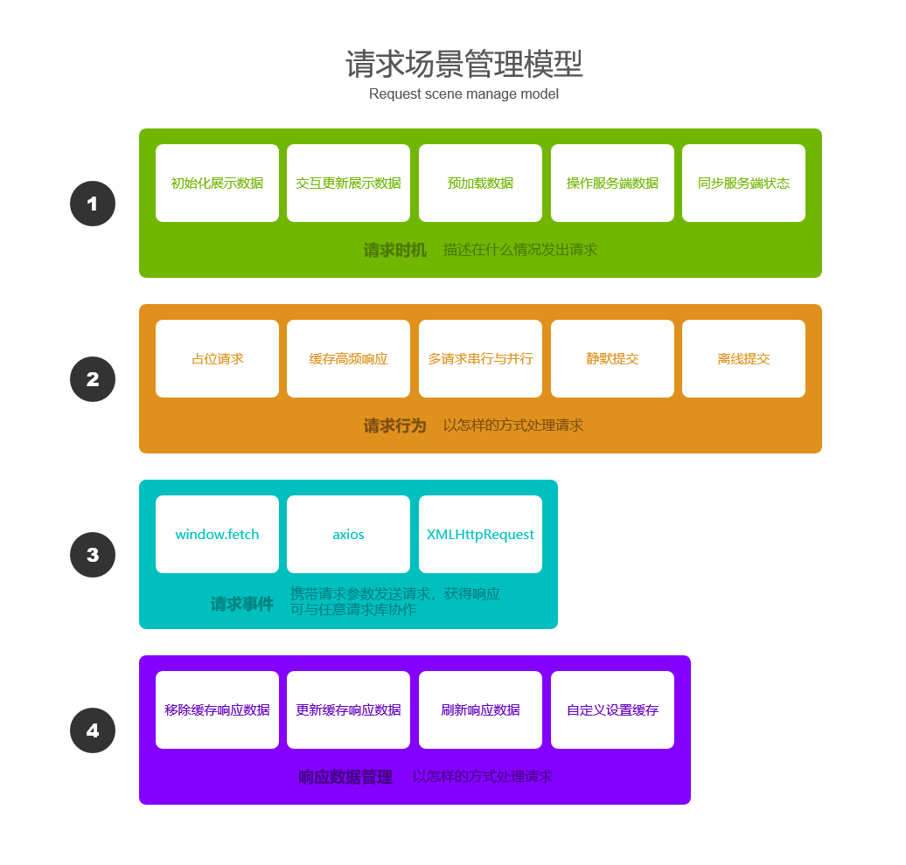

# Alova

> MVVM库的请求场景管理库（Request scene management library for MVVM libraries such as Vue.js and React.js）
## 什么是请求场景管理
我们在进行一次请求时总是要思考以下问题，
1. 什么时候发出请求；
2. 是否要展示请求状态；
3. 是否要封装成请求函数以便重复调用；
4. 要如何加工响应数据；
5. 是否要对高频使用的响应数据做缓存；
6. 如何进行跨页面操作数据；
7. 离线了还能提交数据吗；
8. ...

`fetch`或`axios`往往更专注于如何与服务端交互，但对于上面的问题我们总是需要自己处理，这些有利于应用性能和稳定性的功能，总会让程序员们编写出低维护性的代码。请求场景管理就是对准备请求到响应数据加工完毕的所有环节进行抽象，从而覆盖以前端为视角的，整个CS（Client泛指所有客户端类型）交互生命周期的模型。`Alova`就是一个以请求场景模型的请求场景管理库。


## 请求场景模型 
### 请求时机
描述在什么时候需要发出请求，在`Alova`中以`useHook`实现。
- 初始化展示数据，如刚进入某个界面或子界面；
- 交互更新展示数据，需要变更数据重新发出请求，如翻页、筛选、排序、模糊搜索等；
- 预加载数据，如分页内预先加载下一页内容、预测用户点击某个按钮后预先拉取数据；
- 操作服务端数据，需发出增删改查请求，如提交数据、删除数据等；
- 同步服务端状态，如数据变化较快的场景下轮询请求、操作了某个数据后重新拉取数据；


### 请求行为
描述以怎样的方式处理请求。
- 占位请求，请求时展示loading、骨架图、或者是上次使用的真实数据；
- 缓存高频响应，多次执行请求会使用保鲜数据；
- 多请求串行与并行；
- 静默提交，当只关心提交数据时，提交请求后直接响应成功事件，后台保证请求成功；
- 离线提交，离线时将提交数据暂存到本地，网络连接后再提交；

### 请求事件
表示携带请求参数发送请求，获得响应，`Alova`可以与`axios`、`fetch`、`XMLHttpRequest`等任意请求库协作。

### 响应数据管理
`Alova`将响应数据状态化，并统一管理，任何位置都可以对响应数据进行操作，并利用MVVM库的特性自动更新对应的视图。
- 移除缓存响应数据，再次发起请求时将从服务端拉取；
- 更新缓存响应数据，可更新任意位置响应数据，非常有利于跨页面更新数据；
- 刷新响应数据，可重新刷新任意位置的响应数据，也非常有利于跨页面更新数据；
- 自定义设置缓存，在请求批量数据时，可手动对批量数据一一设置缓存，从而满足后续单条数据的缓存命中；


## 特性
1. React/Vue请求非异步用法
2. 学习成本低，与Axios相似的API
3. 响应数据状态化
4. 响应数据缓存
5. 数据预拉取
6. 静默请求
7. 离线提交
8. 轻量化gzip 3kb
9. typescript支持
10. 支持tree shaking


## 安装
```bash
# 使用npm
npm install alova --save

# 使用yarn
yarn add alova
```

## 使用指南

### 创建Alova实例
一个`Alova`实例是使用的开端
```javascript
import { createAlova, VueHook, GlobalFetch } from 'alova';
const alova = createAlova({
  // 假设我们需要与这个域名的服务器交互
  baseURL: 'http://api.alovajs.org',

  // 假设我们在开发Vue项目，VueHook可以帮我们用vue的ref函数创建请求相关的，可以被Alova管理的状态，包括请求状态loading、响应数据data、请求错误对象error等（后续详细介绍）
  // 如果正在开发React项目，我们可以使用ReactHook
  statesHook: VueHook,

  // 请求适配器，我们推荐并提供了fetch请求适配器
  requestAdapter: GlobalFetch(),
});
```
这就是一个最简单的`Alova`实例的创建参数

### 创建请求方法对象
每个请求